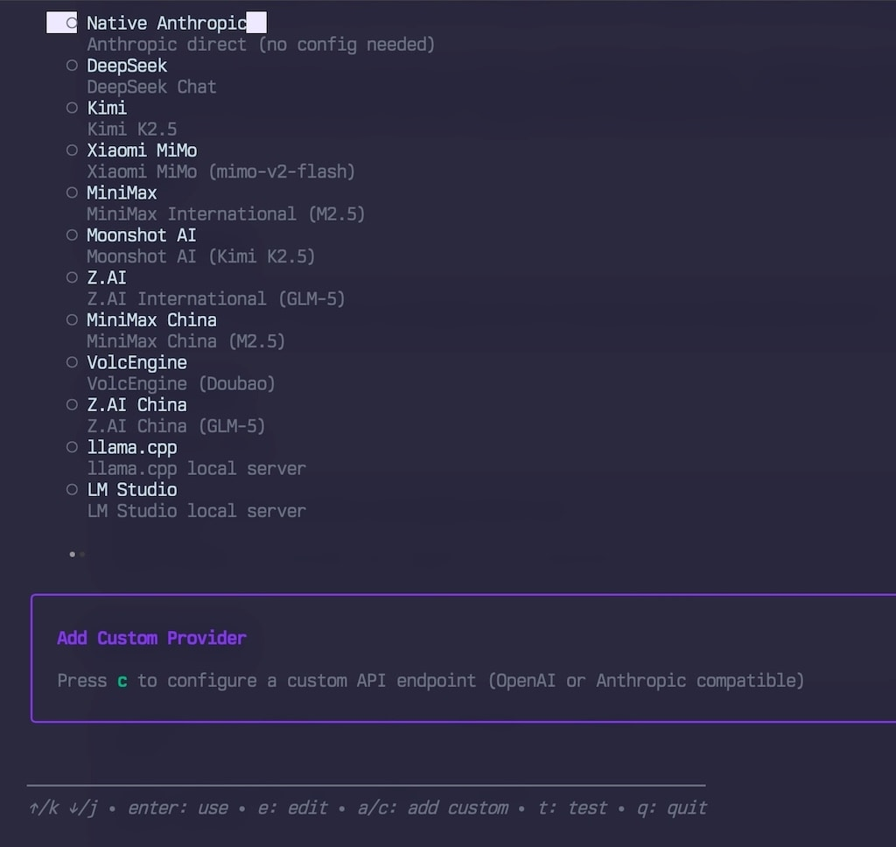
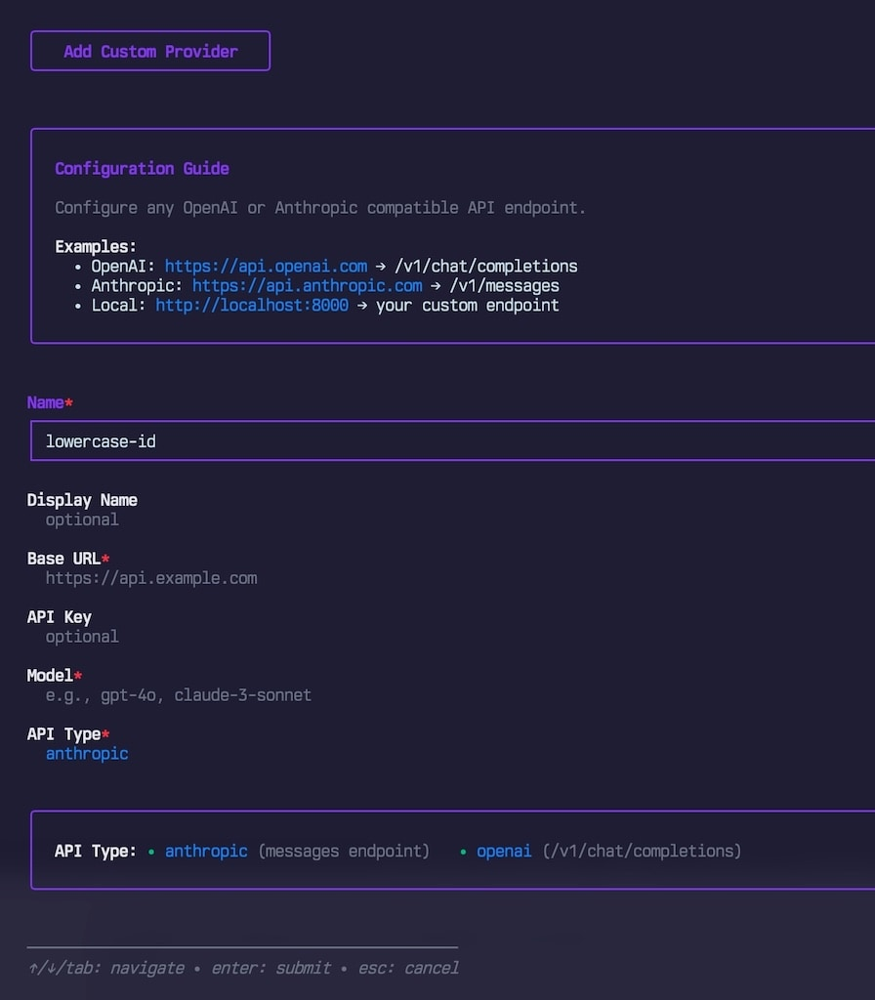

# Skint

Multi-provider launcher for [Claude Code](https://docs.anthropic.com/en/docs/claude-code). Switch between LLM providers with a single command -- use Z.AI, MiniMax, Kimi, DeepSeek, OpenRouter, Anthropic API, llama.cpp, and other endpoints without reconfiguring Claude Code each time.

Skint sets the appropriate environment variables (`ANTHROPIC_BASE_URL`, `ANTHROPIC_AUTH_TOKEN`, model mappings, etc.) and then exec's into the `claude` binary, replacing the current process for clean signal handling.




## Install

```bash
go install github.com/sammcj/skint@HEAD
```

### From source

Requires Go 1.26+.

```bash
git clone https://github.com/sammcj/skint.git
cd skint
make install   # builds and copies to ~/.local/bin
```

## Quick start

```bash
# Launch the interactive TUI to configure a provider
skint

# Use Claude Code with a specific provider
skint use zai

# List configured providers
skint list

# Test provider connectivity
skint test zai
```

## Built-in providers

| Name         | Provider              | Model         | Category      |
| ------------ | --------------------- | ------------- | ------------- |
| `native`     | Claude Subscription   | (default)     | Native        |
| `anthropic`  | Anthropic API         | (default)     | Native        |
| `zai`        | Z.AI                  | GLM-5         | International |
| `minimax`    | MiniMax               | M2.5          | International |
| `kimi`       | Kimi                  | kimi-k2.5     | International |
| `moonshot`   | Moonshot AI           | kimi-k2.5     | International |
| `deepseek`   | DeepSeek              | deepseek-chat | International |
| `openrouter` | OpenRouter            | (any)         | International |
| `ollama`     | Ollama (local)        | --            | Local         |
| `lmstudio`   | LM Studio (local)     | --            | Local         |
| `llamacpp`   | llama.cpp (local)     | --            | Local         |

- **Claude Subscription** (`native`) -- pass-through to your existing Claude subscription. No config needed.
- **Anthropic API** (`anthropic`) -- direct API access using `ANTHROPIC_API_KEY`. Requires an API key from console.anthropic.com.

You can also add custom providers (Anthropic-compatible or OpenAI-compatible endpoints) via `skint config add`.

When configuring a provider in the TUI, the model field supports fetching available models from the provider's API. Press `Ctrl+F` on the model field to fetch models, or they'll be fetched automatically when editing an existing provider.

## Commands

```
skint                        Interactive TUI
skint use <provider> [args]  Launch Claude Code with the given provider
skint exec <cmd> [args]      Run any command with provider env vars injected
skint list                   List configured providers
skint info <provider>        Show provider details
skint test [provider]        Test provider connectivity
skint config                 Configure providers (interactive)
skint config add <provider>  Add a custom provider
skint config remove <name>   Remove a provider
skint status                 Show installation status
skint migrate                Import config from the old bash version
```

### Global flags

```
-c, --config <path>    Config file path
-v, --verbose          Verbose output
-q, --quiet            Minimal output
-y, --yes              Auto-confirm prompts
    --no-input         Non-interactive mode
    --no-color         Disable colours
    --no-banner        Hide startup banner
    --output <format>  Output format: human (default), json, plain
```

## Configuration

Config lives at `~/.config/skint/config.yaml` (XDG-compliant). API keys are stored in your OS keyring (macOS Keychain, Linux libsecret/kwallet) with an AES-256-GCM encrypted file fallback at `~/.local/share/skint/secrets.enc`.

### Environment variable overrides

| Variable                 | Effect                    |
| ------------------------ | ------------------------- |
| `SKINT_DEFAULT_PROVIDER` | Override default provider |
| `SKINT_VERBOSE`          | Enable verbose output     |
| `SKINT_QUIET`            | Minimal output            |
| `SKINT_YES`              | Auto-confirm prompts      |
| `SKINT_NO_INPUT`         | Non-interactive mode      |
| `SKINT_NO_BANNER`        | Hide banner               |
| `NO_COLOR`               | Disable colours           |

## Development

```bash
make build      # Build binary
make test       # Run tests
make lint       # golangci-lint
make fmt        # Format code
make deps       # Download and tidy modules
make build-all  # Cross-compile (macOS/Linux, amd64/arm64)
```
